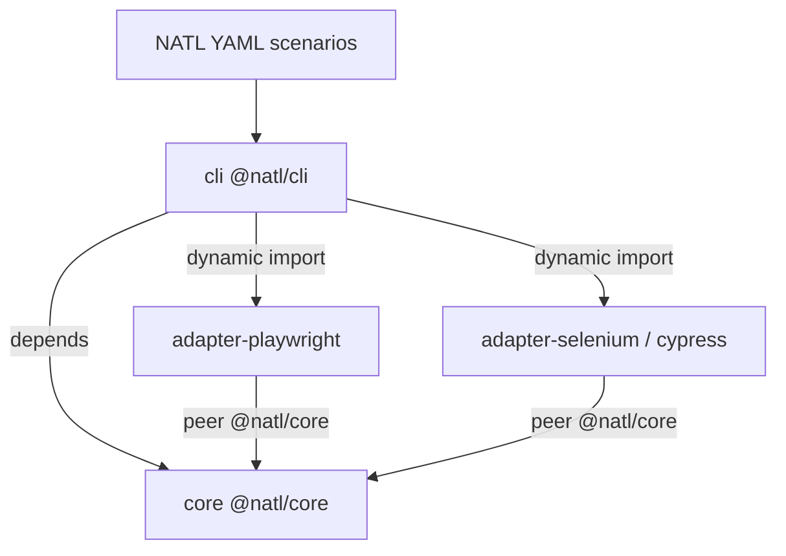

# Architecture

## Idea

NATL separates **what to test** (compact YAML + POM) from **how to drive the browser** (`EngineAdapter` v2). Teams write short fullstack scenarios (UI + HTTP); swapping adapters avoids rewriting typical flows when the stack changes. Browsers and advanced driver APIs are adapter concerns — core passes opaque `browser` / `viewport` factory opts from `natl.config` and does not hard-code a browser matrix.

**Auto-wait** is part of the adapter contract: locator actions (including gestures) and assert reads wait for the target within the step timeout. Explicit `wait:` is for hidden / ms / special states, not for every click→assert pair.

**Gestures** (`scroll` / `swipe` / `long_press`) are first-class YAML steps and adapter methods. Unsupported features must throw a clear error — never silent no-op.

**Locators:** adapters receive `{ strategy, value }` (`LocatorRef`). Default strategy comes from `locator_strategy` in config / page; string elements use that default. Web strategies today: `css`, `xpath`.

**Multi-engine:** `with: http` (and other engines) wraps nested steps; root `engine:` is the default. Built-in `http` needs no UI adapter. Legacy `api:` remains; prefer `get`/`post`/… under `http`.

## Monorepo layout

```text
core/                   @natl/core — language + EngineAdapter contract
adapter-playwright/     @natl/adapter-playwright — default UI engine
adapter-selenium/       @natl/adapter-selenium
adapter-cypress/        @natl/adapter-cypress
cli/                    @natl/cli — loads adapters dynamically
examples/               demo YAML scenarios
docs/                   documentation (GitHub Pages)
```

One Git repository ([arslan-ahmetjanov/natl](https://github.com/arslan-ahmetjanov/natl)); each package directory is published to npm independently.

## Boundaries



- **core** — language, expressions, HTTP helpers, reporters; no UI engine deps
- **adapters** — separate packages; peer on core; own browser/driver matrix
- **cli** — depends on core; loads adapters at runtime via `engine:` / `--engine-package`

Docs: https://arslan-ahmetjanov.github.io/natl/
